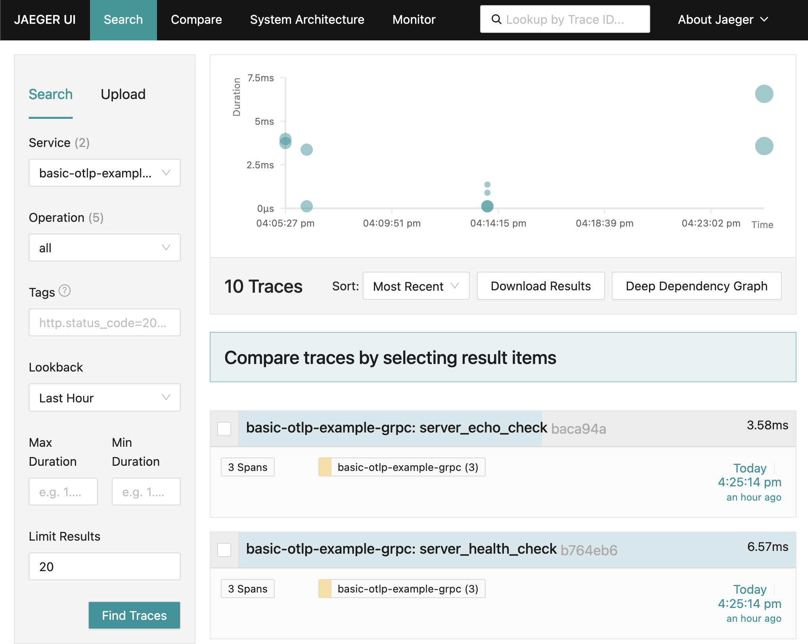
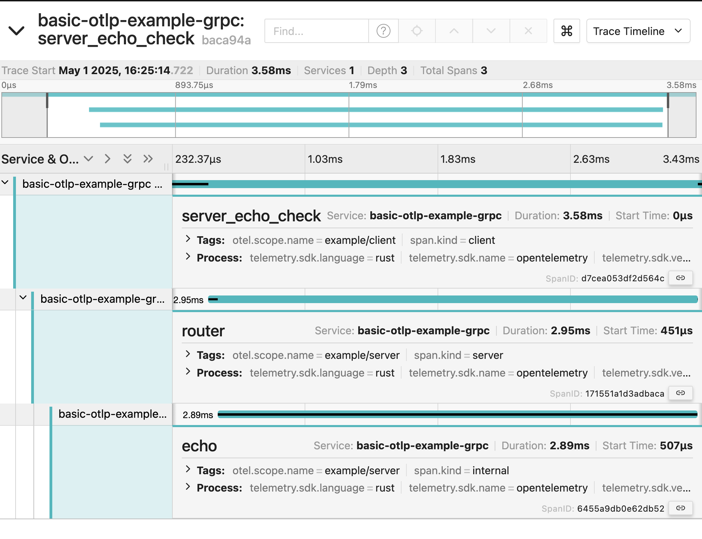

*This example was modified from the forked repo to export the traces (both client and server) to a grpc otlp collector like jaeger*

# HTTP Example

This is a simple example using [hyper] that demonstrates tracing http request
from client to server. The example shows key aspects of tracing
such as:

- Root Span (on Client)
- Child Span from a Remote Parent (on Server)
- Child Span created on the async function parented by the first level child (on Server)
- SpanContext Propagation (from Client to Server)
- Span Events
- Span Attributes
- Context propagation across async task boundaries
- *Exporting traces to an otlp collector (like jaeger)*

[hyper]: https://hyper.rs/

## Usage

```shell
# Run jaeger otlp collector listening on the otlp grpc port
$ docker run -d -p 16686:16686 -p 4318:4318 -p 4317:4317 -e COLLECTOR_OTLP_ENABLED=true jaegertracing/all-in-one:latest

# Run server
$ cargo run --bin http-server

# In another tab, run client
$ cargo run --bin http-client
```

You should see the spans in jaeger at http://localhost:16686/ like so:


